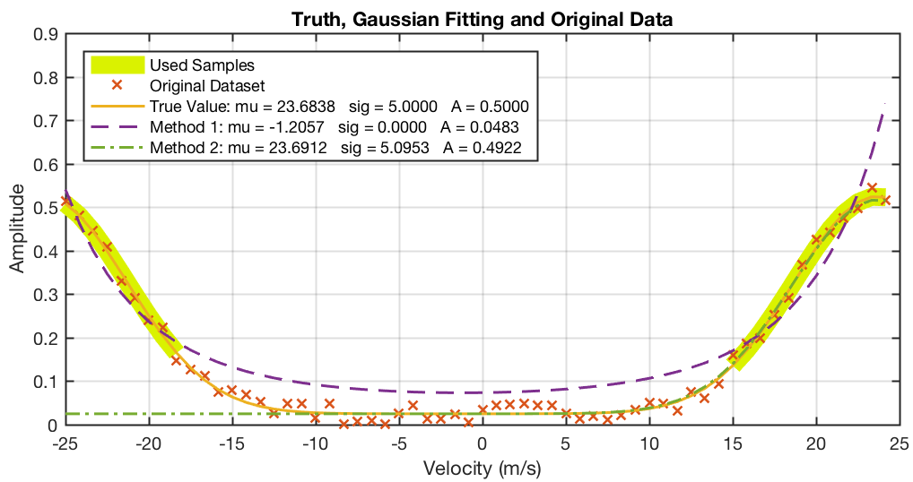

SGFIT
===

An alternate non-recursive implementation of Gaussian fitting. This method uses a complex-plain representation of the spectrum to find the mean, which accounts for the aliasing components of the Gaussian main lobe. The width and the amplitude are then derived by using down-converted Gaussian samples around the mean. The following example illustrate one such example when the conventional Guassian fitting would fail.

