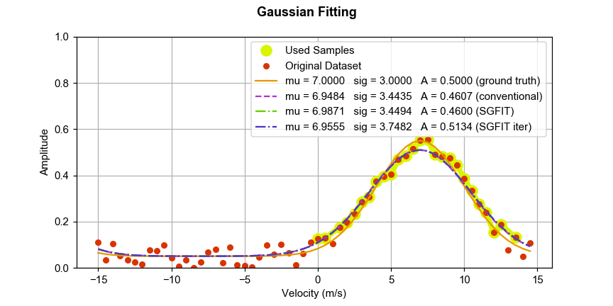

SGFIT
===

An alternate non-recursive implementation of Gaussian fitting. This method uses a complex-plain representation of the spectrum to find the mean, which accounts for the aliasing components of the Gaussian main lobe. The width and the amplitude are then derived by using shifted Gaussian samples around the mean. The following example illustrate a case when conventional Gaussian fitting can be applied successfully. Under this conditions, there is not clear advantage of using SGFIT.

On the other hand, when the main lobe of the spectrum spans across the aliasing limits, conventional Gaussian fitting method would not be able to handle this situation since it no longer fits the assumptions of the model. Under this condition, the conventional method would fail but SGFIT would succeed.

